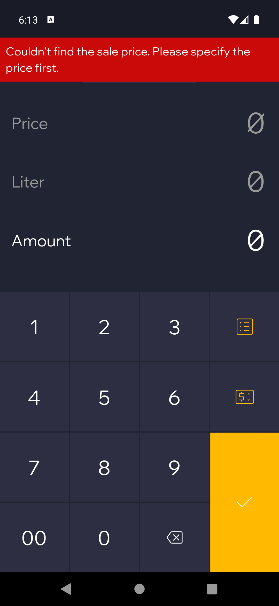
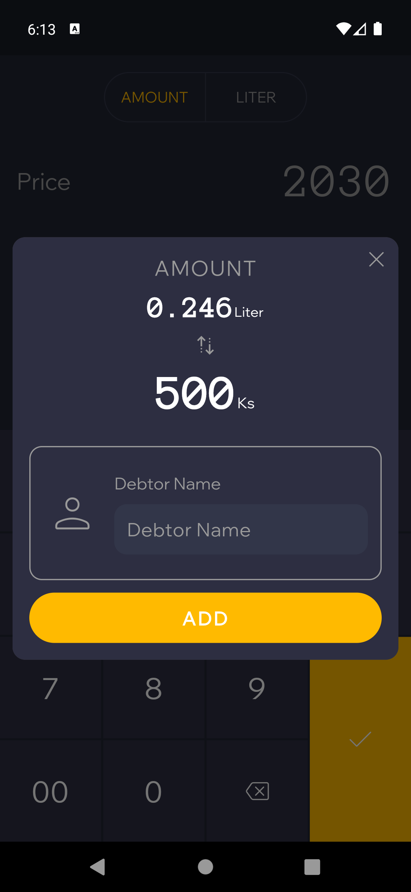
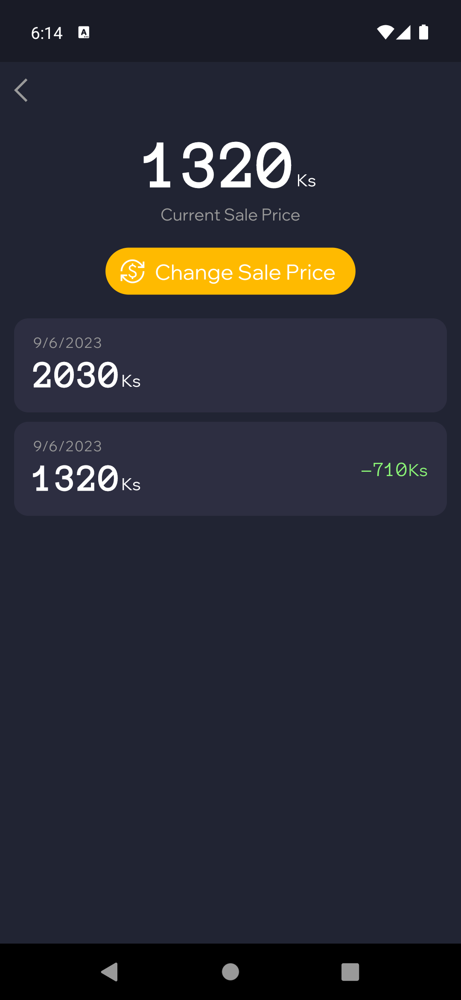
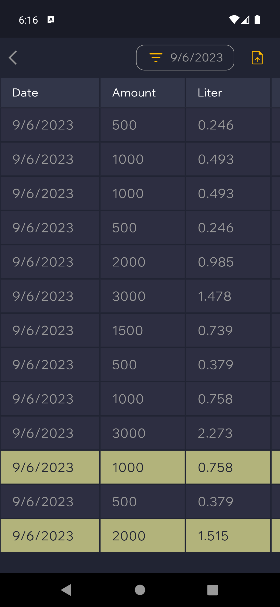
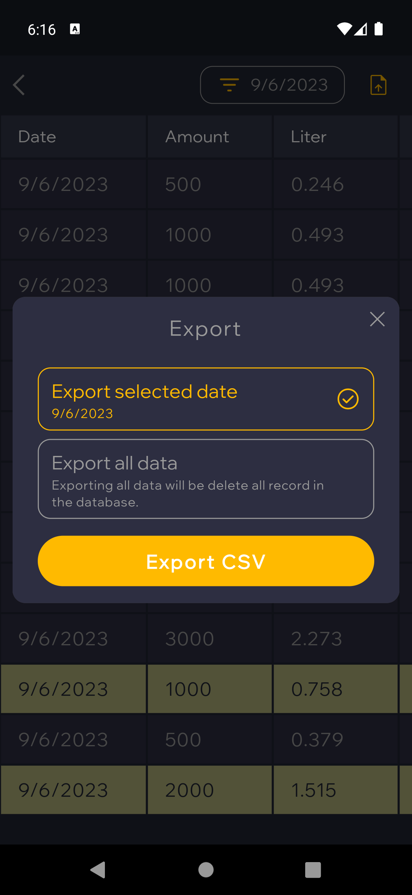

# Fuelog

### A Flutter project for Small Business Petrol Sales Management

##### Supporting the following features
* Recording the sale amount into the local database using SqFlite.
* Sale history list
* Sale price management
  * Updating the sale price
  * Sale price history list
* Converting the sale record to CSV format.

 
 
 
 
 

